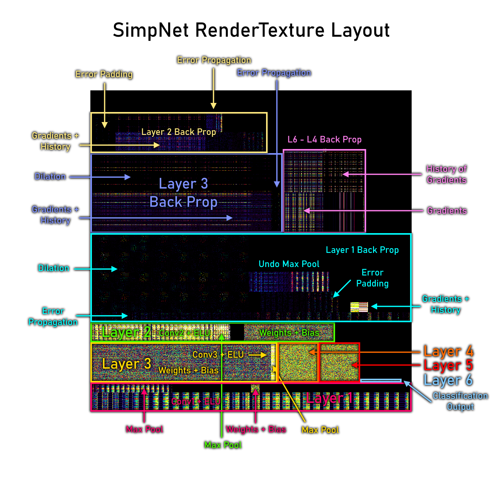

# SimpNet

A trainable convolutional neural network coded inside a fragment shader.

## Overview
* Three version of SimpNet: Python, C++, HLSL
* Python + Keras version is the high level overview of the network structure, also does the offline training.
* C++ + OpenCV version is a low level version to help me convert the network into HLSL.
* HLSL version is the one used in-game in VRChat.
* Four pre-trained networks included: Fruits, Age Classification, Hololive VTubers, and VRC Devs.

The age classifier does not work well with anime faces.

## Live Demo
* https://www.vrchat.com/home/launch?worldId=wrld_4cbc4ccb-3c0d-419d-bc8b-e370c951edd2

## Setup for VRChat
#### Prerequisites
* [VRC SDK 2](https://vrchat.com/home/download) setup in a Unity project
* [VRChat layers must be setup already](https://docs.vrchat.com/docs/)
* [Post Processing V2](https://github.com/Unity-Technologies/PostProcessing) (Not needed, but you do need to remove the missing scripts)
### Avatars
1. Sorry I didn't make a version you can carry around
### Worlds
1. Clone the repository
2. Open the Unity project
3. Import VRCSDK2
4. Remove any missing scripts (Post Processing V2)

OR

1. Open a new Unity project
2. Import VRCSDK2
3. Import the SimpNet.unitypackage in Releases
4. Remove any missing scripts (Post Processing V2)

I will be converting everything to Udon at some point.

## How it Works

